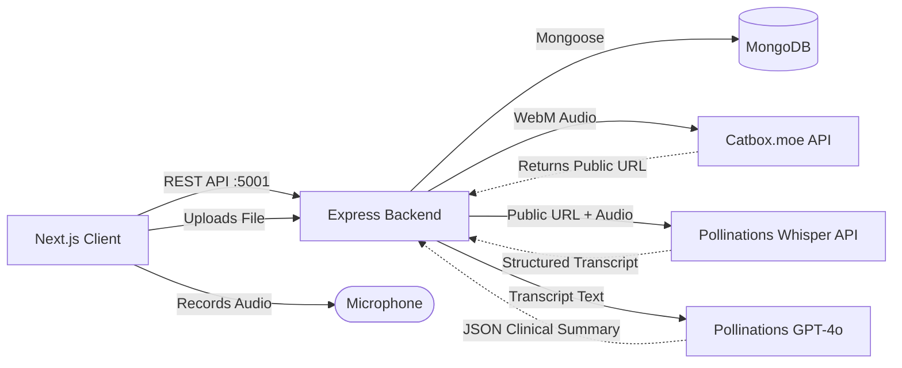

# Architecture & System Design

SwasthyaSetu uses a decoupled client-server architecture. The Next.js frontend communicates with the Express.js backend via a RESTful API. The backend manages state in MongoDB and orchestrates external AI services.

## High-Level Architecture Flow

## Database Schema Design

The system relies on 6 core Mongoose models:

1. **User**: Represents staff members (Doctors, Pharmacists, Lab Techs, Admins). Authentication is handled via bcrypt-hashed passwords and JWTs.
2. **Patient**: Stores patient demographic data.
    - Uses a custom sequential `pid` (e.g., `PID-000001`).
    - Stores the Base64 data URI of the generated QR code.
3. **Consultation**: Represents a single doctor-patient encounter.
    - Links to a `Patient` and `User` (Doctor).
    - Stores the raw audio URL, the transcript, and the AI-generated JSON summary.
4. **Prescription**: Generated automatically from a Consultation.
    - Contains an array of medications with dosages.
    - Status enum: `pending`, `dispensed`.
5. **LabTest**: Generated automatically from a Consultation.
    - Status enum: `ordered`, `sample-collected`, `in-progress`, `completed`.
6. **AuditLog**: A tamper-evident log of all read/write actions on sensitive models (Patient/Consultation).

## The AI Pipeline

The voice consultation feature is the centerpiece of the application:
1. **Capture**: The browser's MediaRecorder API captures a `.webm` audio file.
2. **Buffering**: The file is sent via `multipart/form-data` to the backend.
3. **Transcription (`services/gemini.js`)**: The backend forwards the audio buffer directly to the Pollinations Whisper REST API (`/v1/audio/transcriptions` with model `scribe`).
4. **Analysis**: The resulting text transcript is then sent to the standard Pollinations chat completions endpoint (`AI_MODEL_ID=openai`) accompanied by a strict system prompt demanding a JSON schema.
5. **Routing**: The backend parses the JSON and generates the necessary `Prescription` and `LabTest` MongoDB documents, linking them back to the original `Consultation`.
